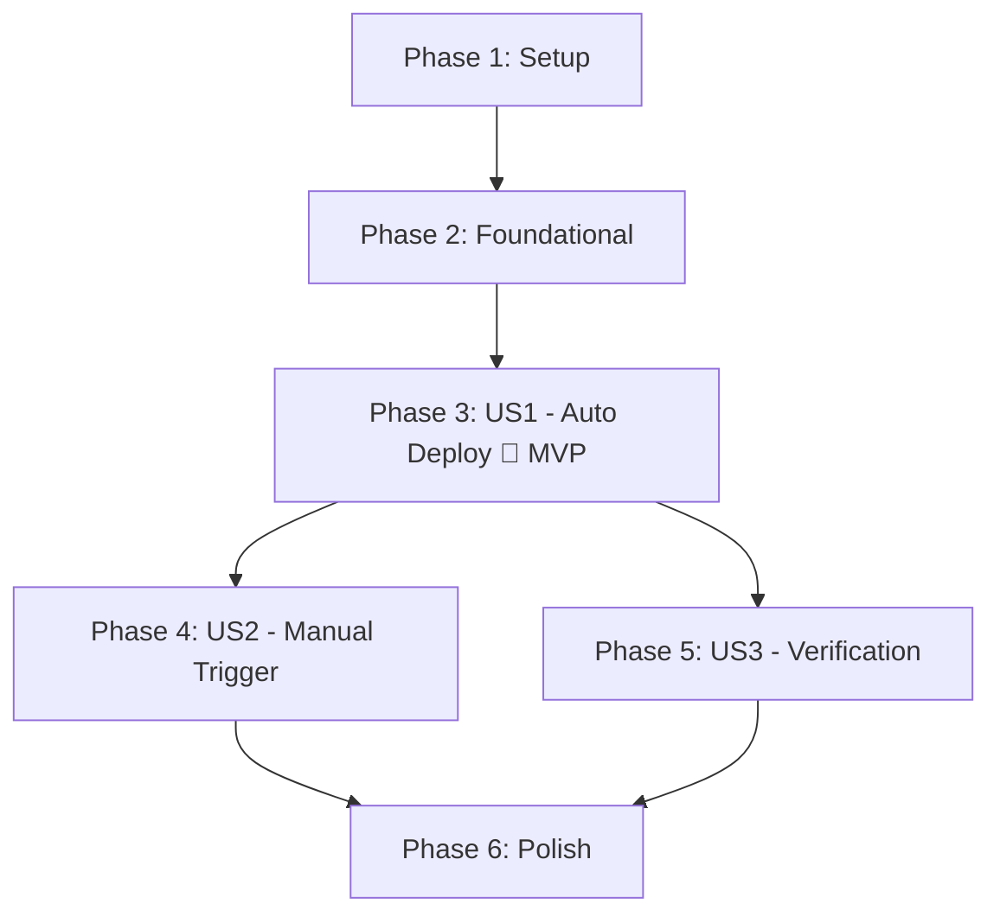

# Tasks: Web Deploy

**Input**: Design documents from `/specs/001-web-deploy/`
**Prerequisites**: plan.md (required), spec.md (required), research.md, data-model.md, contracts/

**Tests**: Not requested — manual browser verification only.

**Organization**: Tasks are grouped by user story to enable independent implementation and testing of each story.

## Format: `[ID] [P?] [Story] Description`

- **[P]**: Can run in parallel (different files, no dependencies)
- **[Story]**: Which user story this task belongs to (e.g., US1, US2, US3)
- Include exact file paths in descriptions

## Path Conventions

- **Single static site**: All source files at repository root
- **Workflow config**: `.github/workflows/`
- No `src/`, `tests/`, `build/`, or `dist/` directories

---

## Phase 1: Setup (Shared Infrastructure)

**Purpose**: Create the CI/CD configuration directory

- [x] T001 Create `.github/workflows/` directory at repository root

---

## Phase 2: Foundational (Blocking Prerequisites)

**Purpose**: Verify that all static assets to be deployed exist in the expected locations

**⚠️ CRITICAL**: No user story work can begin until this phase is complete

- [x] T002 Verify `index.html` exists at repository root and is valid HTML5
- [x] T003 [P] Verify `styles.css` exists at repository root and references all expected CSS custom properties
- [x] T004 [P] Verify `app.js` exists at repository root and contains no embedded secrets, API keys, or credentials (constitution compliance)

**Checkpoint**: Foundation ready — all source assets confirmed; workflow file creation can now begin

---

## Phase 3: User Story 1 - Automatic Deployment on Push (Priority: P1) 🎯 MVP

**Goal**: A push to `main` automatically deploys the static site to GitHub Pages without manual intervention.

**Independent Test**: Push a trivial change (e.g., update a heading text in `index.html`) to the `main` branch, then verify the updated content appears at the GitHub Pages URL within 5 minutes.

### Implementation for User Story 1

- [x] T005 [US1] Create the deployment workflow file `.github/workflows/deploy-web.yml` with the following structure per contract `specs/001-web-deploy/contracts/deploy-web-workflow.md`:
  - Workflow `name` set to `"Deploy to GitHub Pages"`
  - `on.push` trigger scoped to `branches: [main]`
  - `permissions` set to minimum required: `contents: read`, `pages: write`, `id-token: write`
  - `concurrency` group `"pages"` with `cancel-in-progress: true`
  - Single `deploy` job running on `ubuntu-latest` targeting `environment: github-pages` with dynamic `url`
  - Step 1: `actions/checkout@v4`
  - Step 2: `actions/configure-pages@v4`
  - Step 3: `actions/upload-pages-artifact@v3` with `path: "."`
  - Step 4: `actions/deploy-pages@v4` with `id: deployment`

- [x] T006 [US1] Validate the workflow YAML syntax using `actionlint` or GitHub's online workflow validator

**Checkpoint**: At this point, pushing to `main` should trigger an automatic deployment to GitHub Pages. Verify by checking the Actions tab for a successful run and visiting the Pages URL.

---

## Phase 4: User Story 2 - Manual Deployment Trigger (Priority: P2)

**Goal**: A developer can manually trigger a deployment from the GitHub Actions UI without pushing new commits.

**Independent Test**: Navigate to the Actions tab, select "Deploy to GitHub Pages", click "Run workflow", and confirm the deployment completes and the site is served correctly.

### Implementation for User Story 2

- [x] T007 [US2] Add `workflow_dispatch` trigger (no inputs) to the `on:` block in `.github/workflows/deploy-web.yml` alongside the existing `push` trigger

**Checkpoint**: At this point, the workflow should appear in the Actions tab with a "Run workflow" button. Manually trigger it and verify it deploys successfully.

---

## Phase 5: User Story 3 - Verification of Deployed Content (Priority: P3)

**Goal**: Any team member can confirm the deployed application is correct by visiting the public URL.

**Independent Test**: After any deployment, open the GitHub Pages URL in a browser and visually confirm the home page renders correctly with all assets loaded.

### Implementation for User Story 3

- [x] T008 [US3] Add a GitHub Actions status badge to `README.md` displaying the deployment workflow status (format: ``)
- [x] T009 [US3] Document the public GitHub Pages URL in `README.md` under a "Deployment" section

**Checkpoint**: README should show a live status badge and clearly state the deployment URL. Click the badge to confirm it links to the workflow runs page.

---

## Phase 6: Polish & Cross-Cutting Concerns

**Purpose**: Final validation that the feature meets all functional requirements and constitution gates

- [x] T010 [P] Cross-reference `.github/workflows/deploy-web.yml` against all 9 functional requirements (FR-001 through FR-009) in `specs/001-web-deploy/spec.md` — confirm each FR is satisfied
- [x] T011 [P] Cross-reference `.github/workflows/deploy-web.yml` against the contract schema in `specs/001-web-deploy/contracts/deploy-web-workflow.md` — confirm all 10 contract rules pass
- [x] T012 Verify constitution compliance: confirm no secrets in workflow file, HTTPS-only deployment (GitHub Pages default), and CI/CD config is version-controlled
- [x] T013 Run quickstart validation: execute the setup steps in `specs/001-web-deploy/quickstart.md` to verify the documented prerequisites are accurate

---

## Dependencies



- **US1 (P1)**: Depends on Phase 2 (verified assets). US1 is the MVP — the complete workflow file is created here.
- **US2 (P2)**: Depends on US1 (adds one line to the same file). Can run in parallel with US3.
- **US3 (P3)**: Depends on US1 (needs deployment to exist for URL). Can run in parallel with US2.
- **Polish**: Depends on US2 and US3.

## Parallel Execution Examples

### After Phase 2 completes, implement US1:
```
T005 → T006    (sequential: create file, then validate)
```

### After US1 completes, US2 and US3 can run in parallel:
```
Terminal A: T007                    (US2: add workflow_dispatch)
Terminal B: T008 → T009             (US3: README badge + URL docs)
```

### After US2 and US3, run Phase 6 in parallel:
```
Terminal A: T010                    (FR cross-reference)
Terminal B: T011                    (Contract cross-reference)
Terminal C: T012                    (Constitution check)
Terminal D: T013                    (Quickstart validation)
```

## Implementation Strategy

### MVP (User Story 1 Only)

Complete Phases 1–3 to deliver the core value: automatic deployment on push to `main`. This is the minimal viable product — every merged PR will reach end users automatically.

**MVP Deliverable**: A single file `.github/workflows/deploy-web.yml` that triggers on push to `main` and deploys via the 3-step Pages pipeline.

### Full Feature (All User Stories)

After MVP is verified working, add US2 (manual dispatch) and US3 (README documentation) in parallel, then run the polish phase.

---

## Summary

| Phase | Task Count | Story |
|-------|-----------|-------|
| Phase 1: Setup | 1 | — |
| Phase 2: Foundational | 3 | — |
| Phase 3: US1 (P1) | 2 | Automatic Deployment |
| Phase 4: US2 (P2) | 1 | Manual Trigger |
| Phase 5: US3 (P3) | 2 | Verification |
| Phase 6: Polish | 4 | — |
| **Total** | **13** | — |

**Tasks per User Story**: US1=2, US2=1, US3=2
**Parallel Opportunities**: Phase 2 (3 tasks), US2+US3 (after US1), Phase 6 (4 tasks)
**Independent Test Criteria**: Each user story has a clear, standalone test criterion in its phase header.
**MVP Scope**: Phases 1–3 (US1 only, 6 tasks)
